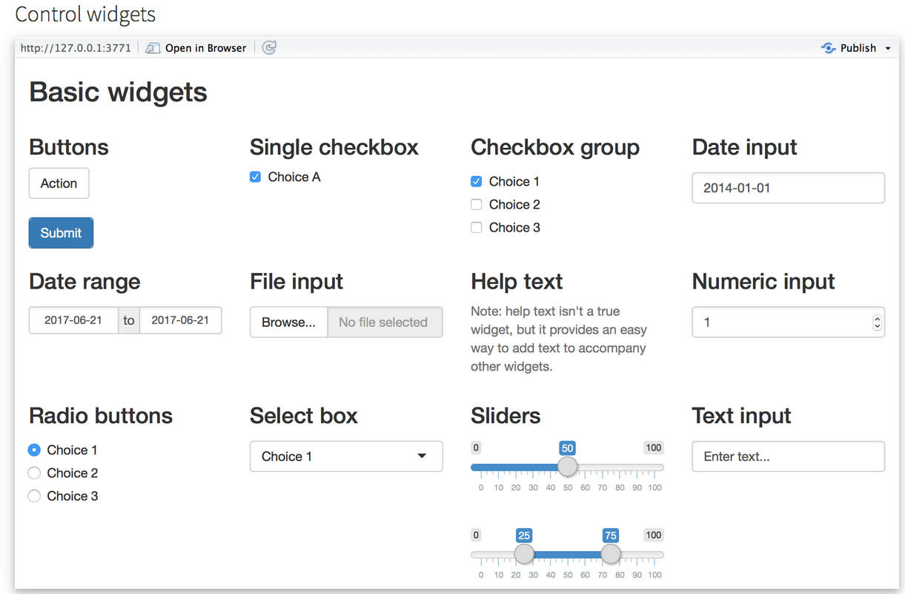
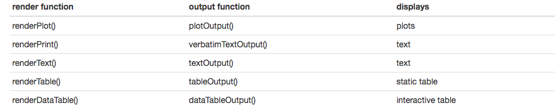
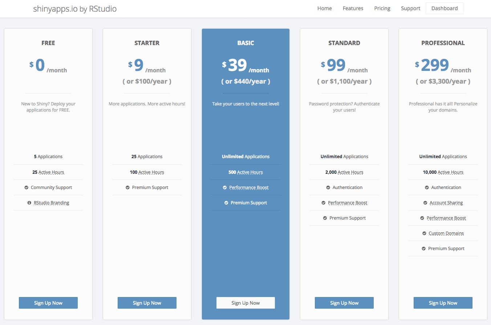
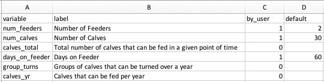
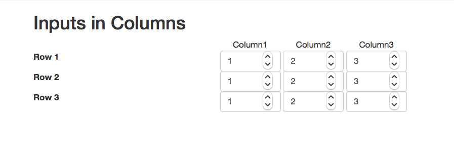
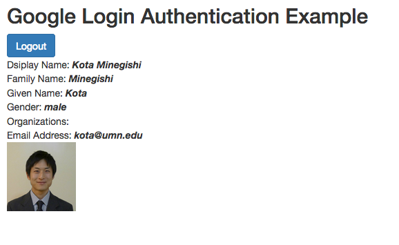
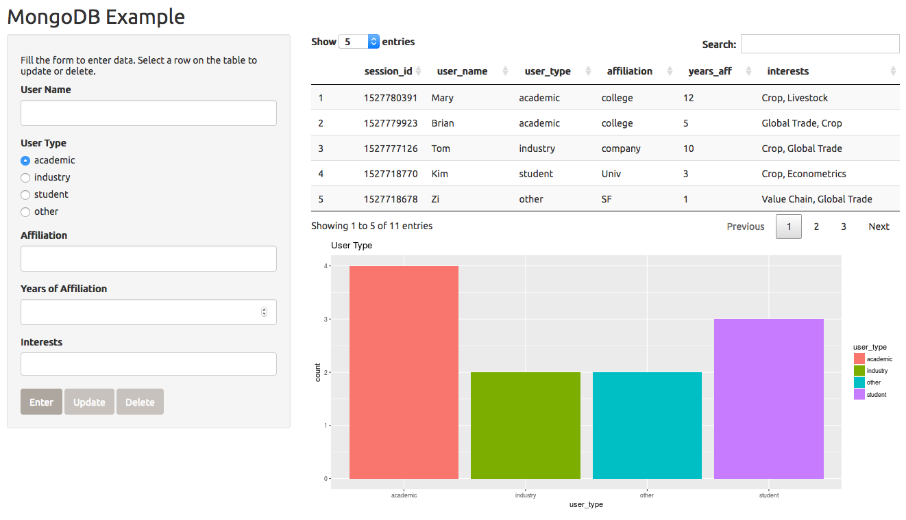
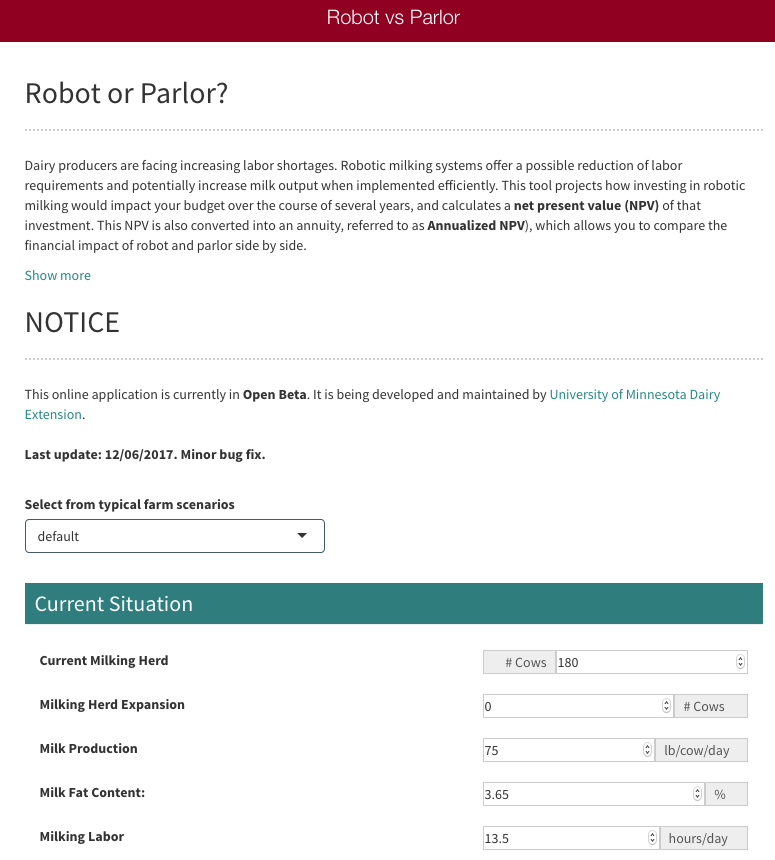
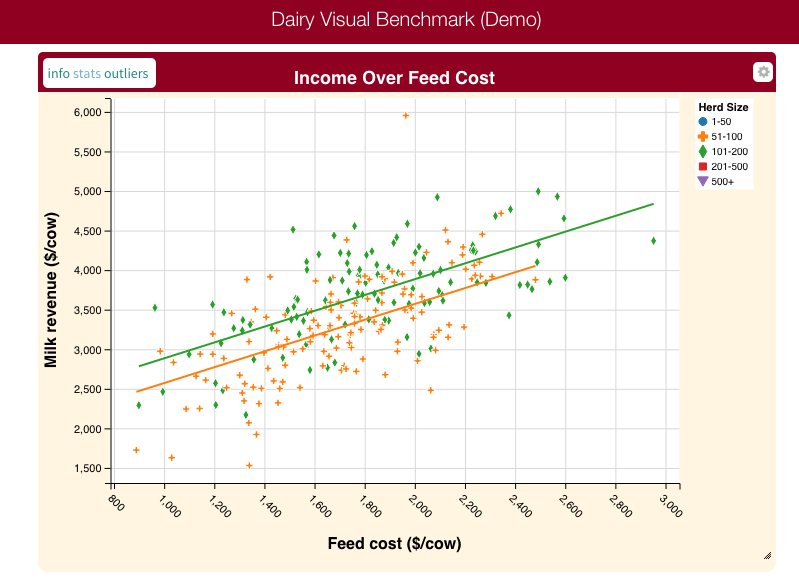
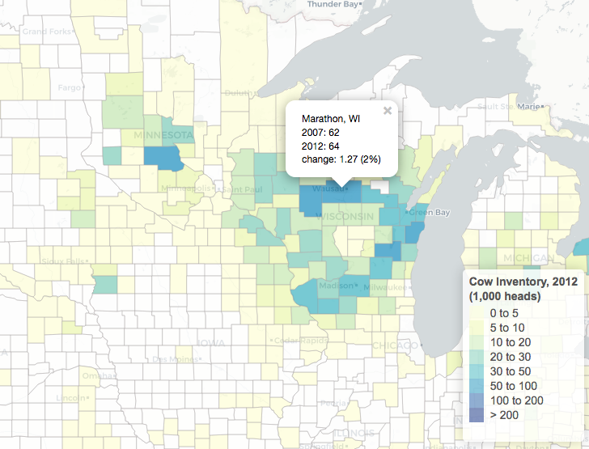

# Introduction {#index}

Agricultural educators and extension researchers developing decision-making tools for farmers have long embraced spreadsheet environments like **Microsoft Excel**. Spreadsheet tools can be useful to assist farmers in financial planning, returns on investment, cost-benefit analysis, production, and market risk assessment etc. To some audiences, unfortunately, *spreadsheet tools can be intimidating or difficult to navigate.*  One way to address this issue is to **convert spreadsheet tools into interactive, online applications for increased accessibility and user experience,** especially through utilizing state-of-the-art user-interface designs, data analytics presentations, and interactive features.

This project provides **a practical, introductory guide for converting spreadsheet tools into  to online applications using programming language R via the Shiny package.**  **R** and **Shiny** are free, and the third-party online service for hosting Shiny applications is extremely low-cost in most situations.


### Overview {-}

* R is **free** & extensive variety of **packages** available   
* R code $\rightarrow$ **interactive webpage**
* No knowledge on HTML/CSS/JavaScript needed 
* Requirements 
  + R 
  + some basic knowledge of R coding
  + (Recommended) Rstudio
  + R packages: shiny 

### Objectives {-}

* Provide a quick introduction of shiny
* Share tips, example codes, and additional resources 
* Initiate a community of decision-tool developers working with shiny

# Calculations in R

Consider a very simple example: <br> 
*How many calves can be fed by calf feeders per year?*   

## Inputs {-}
* Define inputs to calculate calves 
  * number of feeders: default = 2 
  * number of calves: default = 30
  * days calves are fed by the feeder: default = 60
```{r}
num_feeders <- 2 
num_calves <- 30 
days_on_feeder <- 60 
```


## Calculations {-}
* Calculate 
    * total number of calves that can be fed in a given point of time
    * groups of calves that can be turned over a year
    * calves that can be fed per year 


```{r}
calves_total <- num_feeders * num_calves
group_turns <- 365/days_on_feeder
calves_yr <- calves_total * group_turns
```

## Outputs {-}
* Display calculated values 
```{r}
calves_total
group_turns 
calves_yr
```


# Translating R codes into Shiny

## UI and Server

We will put the 3 inputs and 3 outputs above into an interactive Shiny app. Here, we create an **User Interface (UI)** object named as "my_ui" and a **Server Logic** object named as "my_server" and pass them into function `shinyApp()`.  You can run this in `R` or `Rstudio` or deploy it as an online application.   

### UI codes {-}

```{r, eval=FALSE}
# also saved in 'minimum_example1.R' 

# load shiny package 
library(shiny)

my_ui <- 
  fluidPage( 
    h2("How many calves can be fed by calf feeders per year?"),
    h3("Enter your inputs"),
    
    # define inputs
    # numericInput(inputId, label, value, min, max, step, width)
    numericInput(inputId= "num_feeders", label="Number of Feeders", value = 2), 
    numericInput(inputId="num_calves", label="Number of Calves", value = 30), 
    numericInput(inputId="days_on_feeder", label="Days on Feeder", value = 60),
    br(), br(), 
    
    # define outputs   
    h3("Results"), 
    h4("Total number of calves that can be fed in a given point of time"), 
    verbatimTextOutput("calves_total"),  
    h4("Groups of calves that can be turned over a year"),
    textOutput("group_turns"), 
    h4("Calves that can be fed per year "),
    uiOutput("calves_yr")
  )
```

#### Notes on UI  {-}
  + `fluidPage()`: function to define an UI for shiny app
  + To define inputs, we use `numericInput()`
  + To define outputs, we use three different output types via 
      + `verbatimTextOutput()`: show a R object as-is
      + `textOutput()`: show a text object
      + `uiOutput()`: show a User-Interface object such as HTML code 
  + `h2()`,`h3()`, `h4()` are HTML tag functions with varying header levels
  + ` br()` is a HTML tag for line change/spacing 

### Server Logic codes {-}

```{r, eval=FALSE}
# continued from above codes

my_server <- 
  function(input, output) {
    # calculate and store variables as reactive objects 
    calves_total <- reactive({ input$num_feeders * input$num_calves })
    group_turns <- reactive({ 365/input$days_on_feeder })
    
    # render calculated results as outputs 
    output$calves_total <- renderPrint(calves_total())
    output$group_turns <-  renderText(group_turns())
    output$calves_yr <-  renderUI(h4(round(calves_total() * group_turns())))
  }

shinyApp(my_ui, my_server)

```

####  Notes on Server {-}
  + Shiny server logic is a **function** to define relationships between **input** and **output** objects (also this often includes a **session** object).
  + **input** items are accessed by **input$***input_item_name* 
  + **output** items are defined by **output$***output_item_name* 
  + **session** creates a specific instance of the application for each user 
  + `reactive({})`: function to create a reactive object with respect to **input** contents
  + `{ }`  brackets are used in R to bundle multiple evaluation lines (called *expression*)
  + To render outputs, we use the corresponding types of rendering functions 
      + `rendrPrint()`
      + `renderText()`
      + `renderUI()` 
  
  
[Live app is here.](https://kotamine.shinyapps.io/excel_Shiny_minimum_example/)


Here is a screen shot. 


## Reactivity

**Reactivity** makes an online application interactive. As the user changes inputs, the server can return updated calculation results. 

* For most purposes, it suffices to think
  + **input** as a source of trigger for reactivity 
  + **ouput** as an endpoint of the reaction 
  + Learn more: [reactivity-overview](https://shiny.rstudio.com/articles/reactivity-overview.html)

In the above example, if a user changes the value of `input$num_feeders`, this sends a signal to update all **output** items  (visible on the webpage) that are connected to  `input$num_feeders`. This updates `calves_total`, which then updates `output$calves_total` and `output$calves_yr`.   

* Another common way to trigger reactivity is via 
  + `observe({...})`: react to changes in any **input***$inpute_item* in ...  
  + `observeEvent(input$input_trigger, {...})`: react to changes in **input***$input_trigger*

For example, the above example can be modified, so that it only reacts when a button named "Update" is pressed. 

* Notes on this modification
  + `reactiveValues()`: creates a reactive value object (list) 
  + inside `observeEvent()`, reactive updates are specified 
  + reactive values are accessed for rendering by *reactivevlaues_object$item_name*  
```{r, eval=FALSE}
# also saved in 'minimum_example2.R' 

my_server <- 
  function(input, output) {
    
    # define a object (list) for reactive values 
    rv <- reactiveValues(calves_total = NA, group_turns =NA)
    
    # when input$update is pressed 
    # calculate and store variables as reactive objects  
    observeEvent(input$update, {
      rv$calves_total <- input$num_feeders * input$num_calves
      rv$group_turns <-  365/input$days_on_feeder
    })
    
    # render calculated results as outputs 
    output$calves_total <- renderPrint(rv$calves_total)
    output$group_turns <-  renderText(rv$group_turns)
    output$calves_yr <-  renderUI(h4(round(rv$calves_total * rv$group_turns)))
  }

```


## Inputs

* Input types included in `shiny` package, for example   
  + `numericInput()`
  + `actionButton()`
  + `checkboxInput()`
  + `dateInput()`
  + `selectInput()`



## Outputs

* Output types and associated rendering functions included in `shiny` package, for example   
 

There are a variety of ways to include tables, figures, and interactive HTML objects. Here are some examples;  

### Interactive datatables via [DT](https://rstudio.github.io/DT/) {-}
 

### Figures generated by [ggplot2](http://ggplot2.tidyverse.org/) {-}
 


### [HTML widgets](https://www.htmlwidgets.org/showcase_leaflet.html) {-}
Various HTML widgets can be integrated in Shiny apps. Here is an example; 
 


## Layout 

Once you have **input** and **output**, you can arrange them in any way. Typical layout templates include the following; 

### Sidebar layout {-}
 

### Navigation bar layout {-}
 

### Dashboard layout {-}


## Deploy as Online Application

If you use `RStudio`, there is a publish button at the top-right corner of the script editor. 
It is possible to setup a [Shiny Server Open Source](https://www.rstudio.com/products/shiny/shiny-server/) for free, but you have to set up and maintain the server by yourself.  

The easiest way is to use [Rstudio](https://www.rstudio.com/)'s cloud deployment service called  [Shinyapps.io](https://www.shinyapps.io/). It lets you deploy your application at various scales, **starting at \$0 for testing purposes and \$9/month for small-scale applications.**  [Learn more](https://shiny.rstudio.com/deploy/). 

Here is Shinyapps.io's pricing as of May 2018; 


* For serious applications, other RStudio deployment and related services include
   + [Rstudio Connect](https://www.rstudio.com/pricing/#ConnectPricing)
   + [Shiny Server Pro](https://www.rstudio.com/pricing/#ShinyProPricing)


# Tips: from Excel tool to Shiny  

## Excel-like functions 

One can easily define functions in R. For example, functions for Net Present Value, Internal Rate of Returns, and loan payment etc. 
```{r, eval=FALSE}
# saved in helpers_excel.R

npv <- function(rate, values) sum(values / (1 + rate)^seq_along(values))

irr <- function(x, start=0.1) {
  t <- seq_along(x)-1
  f <- function(i) abs(sum(x/(1+i)^t))
  return(nlm(f,start)$estimate)
}

fv <- function(rate, nper, pmt, pv = 0.0, type = 0) {
  pvif <- (1+rate)^nper # Present value interest factor
  fvifa <- if(rate==0) nper else ((1+rate)^nper - 1) / rate
  return(-((pv * pvif) + pmt * (1.0 + rate * type) * fvifa))
}

pv <- function(rate, nper, pmt, fv = 0.0, type = 0) {
  pvif <- (1+rate)^nper # Present value interest factor
  fvifa <- if(rate==0) nper else ((1+rate)^nper - 1) / rate
  return((-fv - pmt * (1.0 + rate * type) * fvifa) / pvif)
}

pmt <- function(rate, nper, pv, fv=0, type=0) {
  rr <- 1/(1+rate)^nper
  res <- (-pv-fv*rr)*rate/(1-rr)
  return(res/(1+rate*type))
}
```


## Read Variables from csv file

When you have many user-provided input variables and many outputs that are returned to the user, it is convenient to automate the definition of **input** and **output** through a loop. 

For example, consider a table of variable name, label, indicator for a user-provided input, default value etc.

   

This kind of table can be converted into UI objects in a loop. For example, each row can be processed by `lapply()` function;

```{r, eval=FALSE}
# saved in minimum_example3.R

df  <- read.csv("variable_data.csv", stringsAsFactors =FALSE) 

my_ui <- 
  fluidPage(
    
    # define inputs
    with(df, 
         lapply(1:nrow(df), function(i) {
           if (by_user[i] == 1) { # select only inputs provided by user
             numericInput(inputId = variable[i], label = label[i], value=default[i])
           }
         })
    ), 
    
    # define outputs   
    with(df, 
         lapply(1:nrow(df), function(i) {
           if (by_user[i] == 0 ) { # select only outputs returned to user 
             uiOutput(variable[i])
           }
         })
    )
  )
```


## Multiple Scenarios in Columns

Excel-based decision-making tools are often designed to contain variables in rows and varying scenarios in columns via CSS.   

An example is shown in *input_columns.R* and *main.css* in *custom_css_example* folder. 

Here is a screen shot; 
 


## Generating a Report 

Using [Rmarkdown](https://rmarkdown.rstudio.com/) and [knitr](https://yihui.name/knitr/), it is easy to add a report function containing texts and objects from a shiny app.  

[Live app is here](https://kotamine.shinyapps.io/report_example/)

Here is a screen shot;
 


## Login via Gmail
A third party user authentication is often more secure than trying to set one up by yourself. We use [googleAuthR](http://code.markedmondson.me/googleAuthR/) package to set up a user login via Google account.  

```{r, eval=FALSE}
# saved in a folder google_longin_example 

library(shiny)
library(googleAuthR) 
library(googleID)
# remotes::install_github("MarkEdmondson1234/googleID") 

# Google login authentication: -----------------------
# for the first time, set up your CLIENT_ID  and CLIENT_SECRET 
# https://console.developers.google.com/apis

options("googleAuthR.webapp.client_id" = CLIENT_ID)
options("googleAuthR.webapp.client_secret" = CLIENT_SECRET)
options("googleAuthR.scopes.selected" =
          c("https://www.googleapis.com/auth/userinfo.email",
            "https://www.googleapis.com/auth/userinfo.profile"))
ems <- function(txt) em(strong(txt)) 

ui <- fluidPage(
  googleAuthUI("loginButton"),
  uiOutput("user_info")
)

server <- 
  function(input, output, session){
  
  user_session <- reactiveValues()

  ## Create access token and render login button
  access_token <- 
    callModule(googleAuth, 
               "loginButton", 
               login_text =  
                 HTML('<i class="fa fa-google fa-1x"></i> Login with Google'),
               logout_class = "btn btn-primary",
               approval_prompt = "force")
  
  jsResetCode <- "shinyjs.reset = function() {history.go(0)}"
  output$fetch_func <- gar_api_generator("https://www.googleapis.com/urlshortener/v1")
  
  # create user_session$info upon google login 
  observeEvent(access_token, {
    if (!is.null(access_token()$credentials$access_token)) {
      user_session$info  <- data.frame(with_shiny(f = get_user_info, 
                                       shiny_access_token = access_token()))
    } else {
      user_session$info <- NULL
    }
  })
  
  # display user info 
  output$user_info <- renderUI({
    if (is.null(user_session$info)) return()
    
    user <- user_session$info

    div(HTML(
        paste("Dsiplay Name:", ems(user$displayName), '<br>',
        "Family Name:", ems(user$name.familyName), '<br>',
        "Given Name:", ems(user$name.givenName), '<br>',
        "Gender:", ems(user$gender),'<br>',
        "Organizations:", ems(user$organizations.name), '<br>',
        "Email Address:", ems(user$emails.value), '<br>'),
        paste0("")
      )) 
    })

}

```

[Live app is here](https://kotamine.shinyapps.io/google_login_example/)

THERE IS A TECHNICAL ISSUE AT THE MOMENT. 

<!--- John, could you fix the "disconnect" issue ?  -->


Here is a screen shot;



[Learn more about authentication options](http://code.markedmondson.me/googleAuthR/articles/google-authentication-types.html#setting-the-client-via-google-cloud-client-json)

## Cloud database via MongoDB 
Along with user authentication, we often find it useful to store user-provided values in a database. If you are hosting a Shiny app in Shinyapps.io, one way to do this is to connect to a cloud database. Here is an example using [mLab's database](https://mlab.com) via [mongolite](https://jeroen.github.io/mongolite/) package.


```{r, eval=FALSE}
library(mongolite)

# set up database and database user at mlab.com 
host <- "ds139920.mlab.com:39920" 
username <- "user2018"
password <- "user2018"
db <- "mlab_example"

url <- paste0("mongodb://",username,":",password,"@", host, "/",db)

# connect to mlab's database 
mdb_users <- mongo(collection="users", db=db, url = url)
mdb_usage <-  mongo(collection="usage", db=db, url = url)

# example of mongo query
usage <- mdb_usage$find("{}")
nrow(usage)
```

[Live app is here](https://kotamine.shinyapps.io/mongoDB_example/)

Here is a screen shot;


## Google Analytics
It is easy to add a usage tracking system via Google Analytics. 

RStuido's instructions: [here](https://shiny.rstudio.com/articles/google-analytics.html) and [here](https://shiny.rstudio.com/articles/usage-metrics.html). 

To get started, here are the two steps; 


[source](http://douglas-watson.github.io/post/2018-02_shiny_google_analytics/)

An example is provided in `minimum_example1.R` file. 

Note: when specifying your URL in Google Analytics, be sure to choose correctly "http" or "https". 

Tracking changes in input variables is also possible. See [JavaScriptEvent in Shiny](http://shiny.rstudio.com/articles/js-events.html). 

[googleAnalyticsR](http://code.markedmondson.me/googleAnalyticsR/) provide a variety of tools to make use of Google Analytics data. 


## Custom Layout, Colors, and HTML modifications 

To an extent, one can choose from various layouts, themes, and color palette options to customize the visual effects of a shiny application and make the application more accessible from mobile phones etc.  While customization is beyond the scope of this tutorial, here are the basics; 


Here is a screen shot; 
 

For more advanced customization, feel free to contact us. Our programmer may have a quick tip or may be hired for a short-term contract. 


# Our project examples 

## Automatic Calf Feeder

[Visit live app](https://kotamine.shinyapps.io/AutomaticCalfFeeder/) 

Here is a screen shot; 


## Milking Robot vs Parlor

[Visit live app](https://kotamine.shinyapps.io/RobotParlor/)

Here is a screen shot; 
  


## Dairy Visual Benchmark

[Visit live app](https://kotamine.shinyapps.io/VisualBenchmark/) 

Here is a screen shot;
  

## Dairy Geography 

[Visit website](https://kotamine.github.io/dairy_maps/) 

Here is a screen shot; 
 


# More on R coding and tutorials 

### Shiny Examples {-}

[RStudio shiny gallery](https://shiny.rstudio.com/gallery/)

 
### Shiny Resources {-}

[R and Shiny cheat sheets](https://www.rstudio.com/resources/cheatsheets/)

[Rstudio's shiny tutorial](https://shiny.rstudio.com/tutorial/)

[DataCamp's shiny tutorial](https://www.datacamp.com/?tap_a=5644-dce66f&tap_s=213387-418a02)

[Tutorial by Dean Attali](https://deanattali.com/blog/building-shiny-apps-tutorial/),    [slides](https://docs.google.com/presentation/d/1dXhqqsD7dPOOdcC5Y7RW--dEU7UfU52qlb0YD3kKeLw/edit#slide=id.gd53c66aaf_0_88), &  [tips](https://github.com/daattali/advanced-shiny)


### R Resources {-}
[Quick R](http://www.statmethods.net/)

[ModernDive](https://ismayc.github.io/moderndiver-book/)

[Author's R Tutorial site](https://kotamine.github.io/piecemealR/)

[Exploratory Data Analysis in R](http://mgimond.github.io/ES218/index.html)


# Contact 

Feel free to contact us. 

### Kota Minegishi {-}
Assistant Professor, Dairy Analytics <br>
Department of Animal Science <br>
University of Minnesota, Twin Cities <br>
Kota@umn.edu


### Johnathan Nault {-}
Programmer Staff<br>
Department of Animal Science <br>
University of Minnesota, Twin Cities <br>
Nault027@umn.edu 


